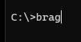

# Brag

This application can be quite useful when it is time to write your periodic self-review.  

A record of all of your wins will allow you to pick the ones that best reflect your performance.

The problem has aways been recording them.  You remember them all?  Yeah right!

You can record them on One Note or Word, or write them in a notebook.  All of these have "friction" making it less likely that you will record your wins, consistently.  

This application allows quick and simple recording of your wins.  

It was also an experiment in working with the constraints that are a console application, instead of a desktop or web application.  

## Instructions
1. Compile and publish the program
2. Copy the .exe file to a directory in your path
3. Open a command prompt
4. Type brag, then hit enter  

5. You will see the main menu  

6. Type 1, then hit enter.  You will be able to add a "brag"  

7. Type your brag.  End by putting a . on the last line, by itself, then hitting enter  

8. Type 2, then hit enter.  You will then see all of your brags.  

9. You can scroll up and down, with the up arrow and down arrow.  Hit escape to exit
10.  When you are finished you can hit escape, to leave the program
11.  You will be shown the location where the files can be found, as a reminder, as you exit the program  

